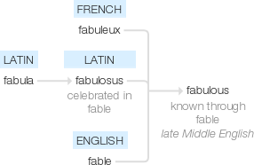

# Fabulous Fit: Where Style Meets Comfort!

> **Website Name:** Fabulous Fit
> 
> **Slogan:** Where Style Meets Comfort!
> 
> **Website URL:** https://fabulous-fit.herokuapp.com/
> 
> **Website Purpose:** To provide a platform for users to purchase clothing and accessories that are both stylish and comfortable.

## Models

### User

I'm using the default Django User model, with the addition of a `seller` field. This field is a ForeignKey to the Seller model, and is null and blank by default. This allows users to create a seller profile, and then link it to their user account.

| Field Name | Field Type | Field Options |
| ---------- | ---------- | ------------- |
| username | CharField | max_length=150, unique=True |
| email | EmailField | max_length=254, unique=True |
| password | CharField | max_length=128 |
| first_name | CharField | max_length=150, blank=True |
| last_name | CharField | max_length=150, blank=True |

### Product

| Field Name | Field Type | Field Options |
| ---------- | ---------- | ------------- |
| name | CharField | max_length=254 |
| description | TextField |  |
| price | DecimalField | max_digits=6, decimal_places=2 |
| image (max = 10 ) | ImageField | upload_to='images' |
| category | ForeignKey | 'Category', null=True, blank=True, on_delete=models.SET_NULL |
| available_status | BooleanField | default=True |
| total_stock (hidden property) | IntegerField | default=0 |
| shipping_cost | DecimalField | max_digits=6, decimal_places=2, null=True, blank=True |
| brand | ForeignKey | 'Brand', null=True, blank=True, on_delete=models.SET_NULL |
| customer_reviews | ForeignKey | 'CustomerReview', null=True, blank=True, on_delete=models.SET_NULL |
| seller | ForeignKey | 'User', null=True, blank=True, on_delete=models.SET_NULL |
| has_sizes | BooleanField | default=False |
| has_colours | BooleanField | default=False |
| has_styles | BooleanField | default=False |
| has_materials | BooleanField | default=False |
| has_occasions | BooleanField | default=False |
| has_seasons | BooleanField | default=False |
| has_necklines | BooleanField | default=False |
| has_sleeves | BooleanField | default=False |
| has_dress_lengths | BooleanField | default=False |
| has_dress_shapes | BooleanField | default=False |
| has_dress_styles | BooleanField | default=False |
| has_dress_details | BooleanField | default=False |
| has_dress_fits | BooleanField | default=False |
| has_dress_occasions | BooleanField | default=False |
| has_dress_necklines | BooleanField | default=False |
| has_dress_sleeves | BooleanField | default=False |

### Category

| Field Name | Field Type | Field Options |
| ---------- | ---------- | ------------- |
| name | CharField | max_length=254 |
| friendly_name | CharField | max_length=254, null=True, blank=True |
| subcategory | BooleanField | default=False |

### Brand

| Field Name | Field Type | Field Options |
| ---------- | ---------- | ------------- |
| name | CharField | max_length=254 |
| about | TextField |  |
| logo | ImageField | upload_to='images' |
| website | URLField | max_length=1024, null=True, blank=True |
| social_media | URLField | max_length=1024, null=True, blank=True |

### CustomerReview

| Field Name | Field Type | Field Options |
| ---------- | ---------- | ------------- |
| name | CharField | max_length=254 |
| review | TextField |  |
| rating | DecimalField | max_digits=6, decimal_places=2, null=True, blank=True |
| date | DateField | auto_now_add=True |
| product | ForeignKey | 'Product', null=True, blank=True, on_delete=models.SET_NULL |
| user | ForeignKey | 'User', null=True, blank=True, on_delete=models.SET_NULL |
| verified_purchase | BooleanField | default=False |
| helpful | IntegerField | default=0 |
| not_helpful | IntegerField | default=0 |

### Seller

| Field Name | Field Type | Field Options |
| ---------- | ---------- | ------------- |
| name | CharField | max_length=254 |
| about | TextField |  |
| logo | ImageField | upload_to='images' |
| website | URLField | max_length=1024, null=True, blank=True |
| social_media | URLField | max_length=1024, null=True, blank=True |

### Size

| Field Name | Field Type | Field Options |
| ---------- | ---------- | ------------- |
| name | CharField | max_length=254 |
| friendly_name | CharField | max_length=254, null=True, blank=True |

## Resources

- Website Name Generated from: [businessnamegenerator.com](https://businessnamegenerator.com/nameideas/?bname=Nexus+Store+Store+Shoppable+Garments+Ebuy+Emart+Shop+Market+Shippr+Instashop+ShipShop+Shopline&device=desktop&shortcode_id=10)
- Website Name List: [website_name.md](website_names.md)
- Favicon Generator: [realfavicongenerator.net](https://realfavicongenerator.net/)
- Image Resizer: [biteable.com](https://biteable.com/tools/image-resizer/)
- Icon Download: [flaticon.com](https://www.flaticon.com/search?type=icon)
- Model TreeForenginKey: [django-mptt.readthedocs.io](https://django-mptt.readthedocs.io/en/latest/overview.html) or [stackoverflow.com](https://stackoverflow.com/questions/60120266/django-categories-and-subcategories) or [stackoverflow.com](https://stackoverflow.com/questions/71523700/how-to-implement-category-subcategory-and-product-in-django)
